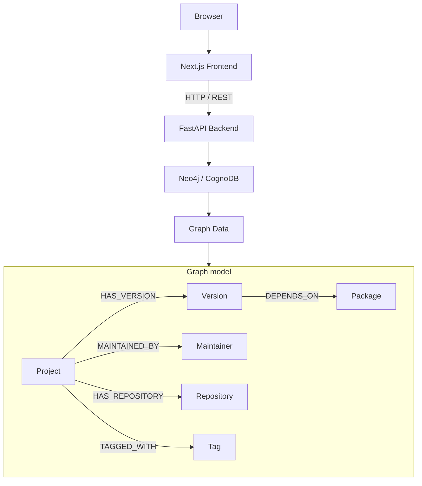
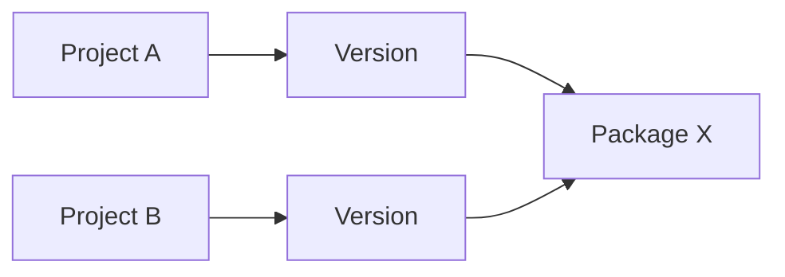

# SourceGraphX


SourceGraphX is a developer-focused Open Source Project Explorer for discovering projects, versions, packages, maintainers, repositories, tags, and shared dependencies through a graph database.

## Problem

Open-source dependency information is spread across project pages, package manifests, release histories, and repository metadata. It is difficult to understand how a project version connects to its packages, who maintains it, where it is hosted, and which other projects may be affected when a dependency is shared.

## Solution

SourceGraphX represents project intelligence as a connected graph in CognoDB/Neo4j. Projects connect to versions, versions connect to packages, and projects connect to maintainers, repositories, and tags. The application uses graph traversal to make dependency exploration and shared-dependency impact analysis easy to inspect.

## Core Features

- Project exploration from a responsive catalog
- Case-insensitive project and package search
- Project detail pages with metadata and release history
- Interactive dependency graph visualization with node selection, pan, and Ctrl+wheel zoom
- Dependency impact analysis using shared package relationships
- Shared dependency detection across projects
- Version history with release dates and dependency counts
- Responsive developer-tool UI for desktop, tablet, and mobile

## Architecture



## Dependency and Impact Analysis

Dependency analysis follows actual graph relationships rather than hardcoded frontend data. A project is connected to its versions, and each version is connected to its packages:



The reverse traversal identifies packages used by the selected project and other projects whose versions depend on those same packages. For example, if Project A and Project B both reach Package X through their versions, Package X is shared and Project B can be returned as an affected/shared-dependency project.

The current impact endpoint returns the source project, shared packages, affected projects, and impact edges for visualization.

## Tech Stack

### Frontend

- Next.js 16.3.3
- React 19.2.8
- TypeScript
- Tailwind CSS 4

### Backend

- Python 3.13.15
- FastAPI 0.141.1
- Uvicorn 0.52.4

### Database

- CognoDB / Neo4j
- Cypher
- Neo4j Python driver 6.2.0
- python-dotenv 1.2.3

### Development

- Git
- GitHub

## Project Structure

```text
sourcegraphx/
├── frontend/
│   ├── app/
│   │   ├── projects/[project_id]/
│   │   ├── search/
│   │   ├── globals.css
│   │   ├── layout.tsx
│   │   └── page.tsx
│   ├── components/
│   │   ├── DependencyGraph.tsx
│   │   ├── Header.tsx
│   │   ├── ProjectCard.tsx
│   │   └── SearchResults.tsx
│   ├── lib/api.ts
│   ├── types/api.ts
│   └── package.json
├── backend/
│   ├── app/
│   │   ├── api/
│   │   ├── core/
│   │   ├── db/
│   │   └── services/
│   ├── requirements.txt
│   ├── seed_database.py
│   └── test_connection.py
├── .gitignore
└── README.md
```

## Setup

The commands below are for Windows PowerShell.

### Backend

```powershell
cd backend
python -m venv .venv
.\.venv\Scripts\Activate.ps1
pip install -r requirements.txt
python -m uvicorn app.main:app --reload
```

The backend runs at `http://127.0.0.1:8000` by default.

### Frontend

In a second PowerShell window:

```powershell
cd frontend
npm install
npm run dev
```

The frontend runs at `http://localhost:3000` by default.

## Environment Variables

Create `backend/.env` with the CognoDB connection settings below:

```dotenv
COGNODB_URI=
COGNODB_USERNAME=
COGNODB_PASSWORD=
```

The actual values are local configuration and must never be placed in this README, frontend environment variables, logs, or commits. `backend/.env` is ignored by Git. The committed template is [backend/.env.example](backend/.env.example).

## Database Seeding

From the backend directory, run:

```powershell
cd backend
.\.venv\Scripts\Activate.ps1
python seed_database.py
```

The seed operation creates the graph constraints and deterministic local dataset using parameterized Cypher and `MERGE`. It is idempotent: running it again does not create duplicate nodes or relationships.

The verified seed dataset contains 91 nodes and 151 relationships across 10 Projects, 20 Versions, 31 Packages, 10 Maintainers, 10 Tags, and 10 Repositories.

To verify the CognoDB connection independently:

```powershell
cd backend
.\.venv\Scripts\Activate.ps1
python test_connection.py
```

A successful connection test prints `CognoDB connection successful!` and does not print credentials.

## API

The FastAPI backend exposes these read-only and health endpoints:

| Method | Endpoint | Purpose |
| --- | --- | --- |
| `GET` | `/health` | Returns the backend health status. |
| `GET` | `/api/projects` | Lists all projects with core metadata. |
| `GET` | `/api/projects/{project_id}` | Returns project metadata, repository, maintainer, tags, and versions. |
| `GET` | `/api/projects/{project_id}/dependencies` | Returns project versions, packages, and version-to-package dependency relationships. |
| `GET` | `/api/projects/{project_id}/impact` | Finds shared packages and other projects that depend on them. |
| `GET` | `/api/search?q=...` | Searches project and package names with case-insensitive partial matching. |

Interactive API documentation is available at `http://127.0.0.1:8000/docs` while the backend is running.

## Screenshots

Screenshots and demo images are reserved for a later documentation pass. No screenshot files are currently included in the repository.

## Engineering Decisions

- **FastAPI:** Provides a small, typed Python REST layer with automatic OpenAPI documentation and straightforward integration with the existing Neo4j driver.
- **Graph database:** Projects, versions, packages, and ownership metadata are relationship-centric, making connected queries and impact traversal natural.
- **Cypher:** Expresses the required graph traversals directly and keeps dependency and impact queries readable.
- **Separated frontend and backend:** The Next.js UI can evolve independently from the API and database layer, with a clear HTTP boundary between them.
- **`MERGE` and idempotent seeding:** Deterministic identifiers and `MERGE` make repeated local seed runs safe and reproducible.

## Validation

The implemented application has been validated with:

- `npm run lint`
- `npm run build`
- Backend CognoDB connection test using `python test_connection.py`
- Seed execution and repeat execution to verify idempotency
- API checks for health, projects, project detail, dependencies, impact, search, and missing-project responses
- Browser checks for project exploration, search, project navigation, dependency graph rendering, and impact analysis
- Responsive browser checks at desktop, tablet, and approximately 390px mobile widths
- Graph interaction checks for node selection, dragging, normal page scrolling, and Ctrl+wheel zoom

No automated test suite has been added yet; the checks above are command-line and browser validation performed during development.

## Limitations and Future Improvements

- Open-source metadata is currently a deterministic local seed rather than being ingested from external project APIs.
- Package results currently provide search metadata but do not have dedicated package detail pages.
- Authentication and production deployment are not implemented.
- An automated backend/frontend test suite would improve regression coverage.
- The graph view currently focuses on the seeded dependency relationships and could support richer layouts and filtering as the dataset grows.

## Resume-Ready Summary

- Built SourceGraphX, a full-stack open-source project explorer using Next.js, FastAPI, and Neo4j/CognoDB to visualize project versions, package dependencies, maintainers, repositories, and tags.
- Implemented parameterized Cypher traversal APIs and deterministic idempotent seeding for 91 graph nodes and 151 relationships.
- Delivered responsive project search, dependency visualization, version history, and shared-dependency impact analysis with validated desktop and mobile UX.
